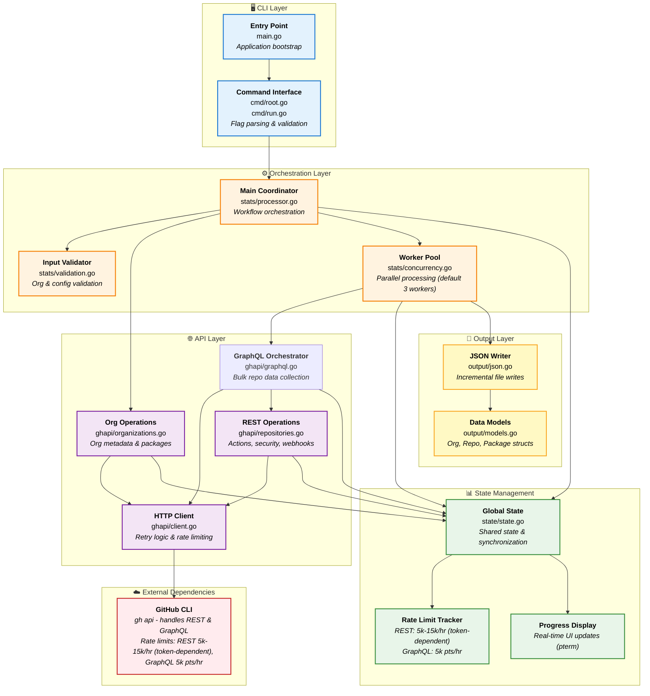

# gh-stats

[](https://pkg.go.dev/github.com/mona-actions/gh-stats)
[](https://goreportcard.com/report/github.com/mona-actions/gh-stats)
[](https://github.com/mona-actions/gh-stats/actions/workflows/build.yml)
[](https://github.com/mona-actions/gh-stats/actions/workflows/test.yml)
[](https://github.com/mona-actions/gh-stats/actions/workflows/lint.yml)
[](https://github.com/mona-actions/gh-stats/actions/workflows/security.yml)
[](https://github.com/mona-actions/gh-stats/releases)

`gh-stats` is a [GitHub CLI](https://cli.github.com) extension that collects and reports statistics about repositories in one or more organizations. Whether you're auditing your organization's repositories, preparing for migrations, or need detailed insights into repository health and activity, this extension may help.

## Table of Contents

- [Quick Start](#quick-start)
- [Install](#install)
- [Usage](#usage)
- [Examples](#examples)
- [Features](#features)
- [Feature Flags: Controlling Data Collection](#feature-flags-controlling-data-collection)
- [Output Format](#output-format)
- [Performance & Rate Limits](#performance--rate-limits)
- [Troubleshooting](#troubleshooting)
- [Architecture](#architecture)
- [Building from Source](#building-from-source)
- [Contributing](#contributing)
- [Developer Guide](DEVELOPER_GUIDE.md)
- [Required Permissions](#required-permissions)
- [License](#license)

## Quick Start

```bash
# Install the extension
gh extension install mona-actions/gh-stats

# Collect stats for an organization
gh stats run --org your-org-name

# Output: gh-stats-2025-10-30.json
```

**That's it!** The tool will collect comprehensive statistics for all repositories in the organization and save them to a date-stamped JSON file.

### What Gets Collected?

By default, `gh-stats` collects:
- ✅ Organization metadata (settings, members, teams)
- ✅ Repository details (size, languages, topics, settings)
- ✅ Activity metrics (issues, PRs, commits, contributors)
- ✅ Security configurations (branch protection, vulnerability alerts)
- ✅ Actions workflows and deployment environments
- ✅ Package information and dependencies
- ✅ Traffic statistics and engagement metrics

### Need to Reduce API Usage?

See [Feature Flags](#feature-flags-controlling-data-collection) to selectively skip optional data and reduce API usage by 30-70%.

## Install

```bash
gh extension install mona-actions/gh-stats
```

## Upgrade

```bash
gh extension upgrade gh-stats
```

## Usage

The tool provides a single `run` command that collects comprehensive statistics for repositories in one or more organizations.

```bash
Usage:
  stats run [flags]

General Flags:
  -o, --org string        GitHub organization to analyze
  -i, --input string      File with list of orgs to analyze
  -O, --output string     Output file path (default: gh-stats-YYYY-MM-DD.json)
  -w, --max-workers int   Maximum number of concurrent API calls (default 3)
  -f, --fail-fast         Stop processing on first error
  -v, --verbose           Enable verbose output
  -r, --resume            Resume from existing output file, skipping already processed repositories
      --dry-run           Show what would be collected without making API calls (preview mode)
      --hostname string   GitHub Enterprise Server hostname (e.g., github.company.com)
  -h, --help              help for run
```

## Examples

### Analyze a Single Organization

```bash
gh stats run --org mona-actions
```

### Analyze Multiple Organizations from File

```bash
# Create a file with organization names (one per line)
echo "mona-actions" > orgs.txt
echo "another-org" >> orgs.txt
```
```bash
# Run analysis
gh stats run --input orgs.txt
```

### Preview Mode (Dry Run)

See what data would be collected without making any API calls:

```bash
gh stats run --org mona-actions --dry-run
```

This shows:
- List of organizations to process
- Configuration summary
- Estimated API usage per repository
- Data points that will be collected

Perfect for planning large collections or estimating API usage before committing to a full run.

### Automatic Resume

The tool automatically resumes from the existing date-stamped output file:

```bash
# Run analysis - automatically resumes if gh-stats-2025-10-30.json exists
gh stats run --org mona-actions
```

The tool detects existing data and skips already-processed repositories. Each day creates a new file with the current date.

### Custom Output File

```bash
gh stats run \
  --org mona-actions \
  --output custom-stats.json
```

### Advanced Configuration

```bash
gh stats run \
  --input orgs.txt \
  --output multi-org-stats.json \
  --max-workers 5 \
  --verbose \
  --fail-fast
```

## Features

- 📊 **Repository Statistics**: Collects metrics including PRs, issues, releases, collaborators, branches, commits, and activity data
- 🏢 **Organization Metadata**: Gathers organization settings, security configuration, members, teams, and packages
- 📦 **Package Information**: Retrieves package counts and version information per repository
- 🌐 **Multi-Organization Support**: Process multiple organizations from a file or command line
- ⚡ **Concurrent Processing**: Configurable worker pool (default 3 workers) for parallel API requests
- 🔄 **Automatic Resume**: Detects existing output and skips already-processed repositories
- 📡 **Real-time Rate Limit Tracking**: Displays remaining REST and GraphQL API quota during execution
- 🔍 **Verbose Logging**: Optional detailed output for debugging and monitoring
- 📄 **JSON Output**: Structured JSON file with organizations, repositories, and packages

## Feature Flags: Controlling Data Collection

The tool provides granular control over what data to collect using `--no-*` flags. This is crucial for:
- **Managing API rate limits** when working with large organizations
- **Speeding up collection** by skipping unnecessary data
- **Reducing bandwidth** for slow connections

### Available Feature Flags

| Flag | Data Skipped | API Savings | Use Case |
|------|-------------|-------------|----------|
| `--no-packages` | Package/dependency info | ~5-10 calls/repo | Skip if not using package registries |
| `--no-actions` | Actions workflows & runs | ~5 calls/repo | Skip if not using GitHub Actions |
| `--no-security` | Security alerts & configs | ~2-4 calls/repo | Skip if not analyzing security |
| `--no-settings` | Advanced repo settings | ~1 call/repo | Skip if only need basic metadata |
| `--no-custom-props` | Custom properties | ~1 call/repo | Skip if not using custom properties |
| `--no-branches` | Branch details (keeps counts) | ~1 call/repo | Skip detailed branch info |
| `--no-webhooks` | Webhook configurations | ~1 call/repo | Skip webhook details |
| `--no-autolinks` | Autolink references | ~1 call/repo | Skip autolink configs |
| `--no-pages` | GitHub Pages config | ~1 call/repo | Skip if not using Pages |
| `--no-issues-data` | Issue details (keeps counts) | ~1 call/repo | Skip detailed issue info |
| `--no-prs-data` | PR details (keeps counts) | ~1 call/repo | Skip detailed PR info |
| `--no-traffic` | Traffic/views statistics | ~2 calls/repo | Skip traffic metrics |
| `--no-tags` | Git tag details | ~1 call/repo | Skip tag information |
| `--no-git-refs` | Git references | ~1 call/repo | Skip git ref details |
| `--no-lfs` | Git LFS information | ~1 call/repo | Skip LFS details |
| `--no-files` | File tree information | ~1 call/repo | Skip file listings |
| `--no-contributors` | Contributor statistics | ~1 call/repo | Skip contributor data |
| `--no-commits` | Commit details (keeps counts) | ~1 call/repo | Skip detailed commit info |
| `--no-issue-events` | Issue event counts | ~1 call/repo | Skip issue event counting |

### Example Usage Scenarios

#### Minimal Collection (Fast, Low API Usage)

Best for quick audits or when rate limited:

```bash
gh stats run --org my-org \
  --no-packages \
  --no-actions \
  --no-security \
  --no-traffic \
  --no-webhooks \
  --no-contributors \
  --no-commits \
  --no-issue-events
```

**API Usage**: ~17 org calls + ~15 calls/repo (saves ~50-60% of API calls)

#### Medium Collection (Balanced)

Good balance between data completeness and API usage:

```bash
gh stats run --org my-org \
  --no-packages \
  --no-traffic \
  --no-lfs \
  --no-files
```

**API Usage**: ~17 org calls + ~20-25 calls/repo (saves ~30% of API calls)

#### Full Collection (Complete Data)

Collects all available data (default behavior):

```bash
gh stats run --org my-org
```

## Input File Format

The input file should contain one organization name per line. Lines starting with `#` are treated as comments:

```
# Organizations to analyze
mona-actions
another-org
# third-org  # commented out
```

## GitHub Enterprise Server Support

`gh-stats` works with GitHub Enterprise Server (GHES) instances. Specify your GHES hostname using the `--hostname` flag:

```bash
# Analyze organization on GHES
gh stats run --org myorg --hostname github.company.com

# Multiple organizations from a GHES instance
gh stats run --input orgs.txt --hostname github.company.com

# With other options
gh stats run --org myorg --hostname github.company.com \
  --max-workers 5 \
  --verbose \
  --no-packages
```

**Note**: Ensure you're authenticated with the GHES instance using `gh auth login --hostname github.company.com` before running the tool.

## Output Format

The tool generates a consolidated JSON file with a date-stamped filename (e.g., `gh-stats-2025-10-29.json`) containing three main sections:

### JSON Structure

```json
{
  "orgs": [
    {
      "login": "mona-actions",
      "name": "Organization Name",
      "description": "Organization description",
      "url": "https://github.com/mona-actions",
      "publicRepos": 25,
      "membersCount": 10,
      "teamsCount": 5,
      "createdAt": "2020-01-01T00:00:00Z",
      "updatedAt": "2025-01-01T00:00:00Z",
      ...
    }
  ],
  "repos": [
    {
      "org": "mona-actions",
      "repo": "example-repo",
      "url": "https://github.com/mona-actions/example-repo",
      "isFork": false,
      "isArchived": false,
      "sizeMB": 1.5,
      "hasWiki": true,
      "createdAt": "2023-01-01T00:00:00Z",
      "updatedAt": "2025-01-15T00:00:00Z",
      "pushedAt": "2025-01-15T00:00:00Z",
      "collaborators": 5,
      "branches": 10,
      "tags": 3,
      "protectedBranches": 1,
      "issues": 15,
      "pullRequests": 25,
      "milestones": 2,
      "releases": 5,
      "projects": 1,
      "discussions": 3,
      "commitComments": 10,
      "packages": 2,
      "packageVersions": 15
    }
  ],
  "packages": [
    {
      "org": "mona-actions",
      "repo": "example-repo",
      "packageName": "my-package",
      "packageType": "npm",
      "visibility": "public",
      "createdAt": "2023-01-01T00:00:00Z",
      "updatedAt": "2025-01-15T00:00:00Z",
      "versionCount": 10
    }
  ]
}
```

### Organization Data

The `orgs` array contains comprehensive metadata for each organization including:
- Basic information (name, description, URL)
- Statistics (public/private repos, members, teams)

### Repository Data

The `repos` array contains detailed statistics for each repository including:
- Repository metadata (name, URL, fork status, archive status)
- Size and configuration (size in MB, wiki status)
- Timestamps (created, updated, last pushed)
- Collaboration metrics (collaborators, branches, protected branches)
- Activity metrics (issues, PRs, milestones, releases, discussions)
- Package counts (number of packages and total versions)

### Package Data

The `packages` array contains detailed package information:
- Package identification (name, type, visibility)
- Associated repository (or "unassigned" for org-level packages)
- Version count (if available)
- Timestamps (created, updated)

**Note**: Some package types may not provide version count information through the GitHub API, so this field may be empty for certain packages.

### Example Output

```
Processing organization: mona-actions
Found 25 repositories in mona-actions
✓ repo1
✓ repo2
⚠ repo3
✓ repo4
...
📊 Complete! Processed 25/25 repos | Total API calls: 156
```

## Performance & Rate Limits

### Understanding GitHub Rate Limits

GitHub enforces two separate rate limits:

1. **REST API**: 5,000-15,000 calls/hour (depends on token type: 5k for personal access tokens, 15k for OAuth/GitHub App tokens)
2. **GraphQL API**: 5,000 points/hour (queries cost variable points based on complexity)

The tool tracks both limits separately and displays them in real-time:

```
Processing 32 repositories... [REST: 64/15000 - GQL: 39/5000] [32/32]  100% | 13s
```

### API Usage Estimates

**Typical usage**: ~17 org-level calls + ~25-36 calls per repo (varies by features enabled)

| Repos | Total API Calls | Time with 3 workers (default) |
|-------|----------------|-------------------------------|
| 100   | ~2,517-3,617   | 15-25 minutes                 |
| 1,000 | ~25,017-36,017 | 2-5 hours                     |

**Rate limit constraints** (assuming 70% GraphQL / 30% REST split):
- **5k REST / 5k GraphQL**: ~277-357 repos/hour maximum
- **15k REST / 5k GraphQL**: ~139-178 repos/hour (GraphQL bottleneck)

⚠️ **Note**: These are estimates for average-sized repositories. Large repositories with thousands of issues, PRs, or branches consume significantly more API quota and take longer to process.

### Optimization Strategies

#### 1. Use Feature Flags

Skip unnecessary data collection using `--no-*` flags. See [Feature Flags](#feature-flags-controlling-data-collection) section for complete list and detailed examples.

#### 2. Adjust Worker Concurrency

- **Default**: 3 workers (good balance)
- **Conservative**: 1-2 workers (safest, slower)
- **Aggressive**: 4-5 workers (faster, may hit rate limits)

```bash
gh stats run --org my-org -w 5
```

**Note**: Higher concurrency can trigger rate limiting faster. Monitor the progress bar for rate limit status.

#### 3. Leverage Automatic Resume

The tool writes each repository immediately to disk. If interrupted, just re-run the same command—it automatically detects existing data and skips already-processed repositories.

#### 4. GraphQL-First Design

The tool is optimized to minimize API calls:
- **Bulk queries**: Fetch multiple data points in single GraphQL requests
- **Count-only fields**: Use `first: 0` to get counts without transferring data
- **Smart batching**: Combine related queries to reduce round trips
- **Incremental writes**: Stream output to prevent memory bloat

### Monitoring API Usage

The tool provides real-time visibility into API consumption:

**During execution:**
```
Processing 32 repositories... [REST: 64/15000 - GQL: 39/5000] [32/32]  100% | 13s
```

**At completion:**
```
 INFO  REST: 64/15000 used (14936 remaining, resets at 01:46:48)
 INFO  GraphQL: 40/5000 used (4960 remaining, resets at 02:03:54)
 SUCCESS  ✓ Complete! Processed 32/32 repos | REST API: 14 calls | GraphQL API: 38 calls
```

**Progress updates**: Displays rate limit status every 50 API calls during large operations

### When You Hit Rate Limits

If you encounter rate limit errors:

1. **Check reset time**: `gh api rate_limit`
2. **Reduce data collection**: Use `--no-*` flags to skip optional data
3. **Lower concurrency**: Use `-w 1` or `-w 2` to slow down API consumption
4. **Wait and resume**: Rate limits reset hourly; the tool auto-resumes where it left off
5. **Run during off-peak hours**: Better API response times and availability

### Best Practices

✅ **Do:**
- Use feature flags for large organizations (>100 repos)
- Monitor the progress bar for rate limit status
- Let batches complete before interrupting
- Use resume capability for multi-hour runs
- Start with default 3 workers, adjust based on rate limit feedback

❌ **Don't:**
- Set workers >5 without monitoring rate limits
- Collect unnecessary data (use flags strategically)
- Interrupt frequently (hurts efficiency)

## Troubleshooting

### Common Issues

#### Authentication Errors

**Symptom**: 401 or 403 errors

**Solution**:
1. Verify GitHub CLI authentication: `gh auth status`
2. Re-authenticate if needed: `gh auth login`
3. Ensure token has required scopes: `repo`, `read:org`, `read:packages`

#### Incomplete Data Collection

**Symptom**: Some repositories show warnings or missing data

**Solution**:
- Check the output for specific error messages
- Verify you have access to all repositories in the organization
- Some fields may be unavailable if repositories are archived or have features disabled

#### Rate Limits or Slow Performance

See [Performance & Rate Limits](#performance--rate-limits) section for:
- Understanding rate limits and monitoring
- Optimization strategies with feature flags
- Timing estimates and troubleshooting guidance

### Verbose Mode

Enable detailed output for debugging (use the `-v` or `--verbose` flag):

```bash
gh stats run --org my-org --verbose
```

This shows:
- Individual API calls being made
- Rate limit status after each major operation
- Detailed error messages for failures
- Progress for each repository processed

### Getting Help

If you encounter issues:

1. Check the [GitHub Issues](https://github.com/mona-actions/gh-stats/issues) for similar problems
2. Enable verbose mode and include the output in your issue report
3. Include your gh-stats version: `gh extension list`
4. Describe your environment (OS, GitHub CLI version, organization size)

## Architecture

### System Overview

`gh-stats` uses a layered architecture with a worker pool for concurrent data collection from GitHub's REST and GraphQL APIs:



### Data Flow

1. **Input Processing**: CLI parses flags and validates organization names or input files
2. **Rate Limit Check**: Verifies sufficient API quota before starting
3. **Organization Loop**: Processes each organization sequentially
4. **Parallel Repository Processing**: Worker pool fetches data for multiple repos concurrently
5. **Incremental Persistence**: Each repository's data is written to disk immediately
6. **Rate Limit Monitoring**: Continuously tracks both REST and GraphQL limits
7. **Resume Capability**: Automatically skips already-processed repositories on restart

### Key Design Patterns

- **Worker Pool**: Semaphore-based concurrency control (default: 3 workers)
- **Dual Rate Limiting**: Separate tracking for REST and GraphQL APIs
- **Incremental Output**: Append-only writes prevent data loss on interruption
- **Error Resilience**: Non-critical errors logged as warnings, processing continues
- **Context Propagation**: Graceful cancellation with Ctrl-C support

### Package Responsibilities

| Package | Responsibility | Key Files |
|---------|---------------|-----------|
| `cmd` | CLI interface and command routing | `root.go`, `run.go` |
| `stats` | Orchestration and parallel processing | `processor.go`, `concurrency.go`, `validation.go` |
| `ghapi` | GitHub API interaction layer | `client.go`, `graphql.go`, `organizations.go`, `repositories.go` |
| `state` | Global state and rate limit tracking | `state.go` |
| `output` | Data serialization and file I/O | `json.go`, `models.go` |

## Building from Source

```bash
# Clone the repository
git clone https://github.com/mona-actions/gh-stats.git
cd gh-stats

# Install dependencies
go mod download

# Build the extension
go build -o gh-stats

# Run tests
go test ./...
go test -race ./...

# Install golangci-lint v2.x (required for linting)
go install github.com/golangci/golangci-lint/cmd/golangci-lint@v2.6.0

# Run linter
golangci-lint run

# Install as a GitHub CLI extension
gh extension install .
```

## Contributing

We welcome contributions! Please see [CONTRIBUTING.md](.github/CONTRIBUTING.md) for detailed guidelines and our [Developer Guide](DEVELOPER_GUIDE.md) for technical documentation.

### Quick Contribution Guide

1. **Fork and clone** the repository
2. **Create a feature branch**: `git checkout -b feature/your-feature`
3. **Make your changes** following our [Developer Guide](DEVELOPER_GUIDE.md)
4. **Add tests** for new functionality
5. **Update documentation** (godoc comments, README)
6. **Run tests**: `go test ./...` and `go test -race ./...`
7. **Submit a pull request** with a clear description

## Required Permissions

The tool requires the following GitHub token permissions:

- **Repository access**: `repo` scope for private repositories
- **Organization access**: `read:org` for organization repositories
- **Package access**: `read:packages` for package statistics

### Verify and Grant Permissions

To ensure your GitHub CLI has the required scopes:

```bash
# Check current authentication status
gh auth status

# Refresh authentication with required scopes
gh auth refresh --scopes repo,read:org,read:packages
```

If you need to authenticate for the first time:

```bash
gh auth login --scopes repo,read:org,read:packages
```

## License

This project is licensed under the MIT License - see the [LICENSE](LICENSE) file for details.

## Credits

Built with ❤️ by the :octocat: Expert Services Team
