# gh-stats

<div align="center">
<br><br>

[](https://pkg.go.dev/github.com/mona-actions/gh-stats)
[](https://goreportcard.com/report/github.com/mona-actions/gh-stats)
[](https://github.com/mona-actions/gh-stats/actions/workflows/build.yml)
[](https://github.com/mona-actions/gh-stats/actions/workflows/lint.yml)
[](https://github.com/mona-actions/gh-stats/releases)

**A [GitHub CLI](https://cli.github.com) extension for comprehensive repository auditing and migration planning**

Collect detailed statistics about repositories, and organizations with intelligent rate limiting and resume capability.

</div>

---

## Table of Contents

- [Quick Start](#quick-start)
- [Install](#install)
- [Required Permissions](#required-permissions)
- [Usage](#usage)
- [Examples](#examples)
- [Features](#features)
- [Feature Flags: Controlling Data Collection](#feature-flags-controlling-data-collection)
- [Output Format](#output-format)
- [Performance & Rate Limits](#performance--rate-limits)
- [Troubleshooting](#troubleshooting)
- [Architecture](#architecture)
- [Building from Source](#building-from-source)
- [Contributing](#contributing)
- [Developer Guide](DEVELOPER_GUIDE.md)
- [License](#license)

## Quick Start

```bash
# Install the extension
gh extension install mona-actions/gh-stats

# Collect stats for an organization
gh stats --org your-org-name

# Output: gh-stats-2025-10-30.json
```

**That's it!** The tool collects comprehensive statistics (organization metadata, repository details, activity metrics, security configs, packages) and saves them to a date-stamped JSON file.

See [Output Format](#output-format) for complete data details and [Feature Flags](#feature-flags-controlling-data-collection) to reduce API usage by 30-70%.

## Install

```bash
gh extension install mona-actions/gh-stats
```

## Upgrade

```bash
gh extension upgrade gh-stats
```

### Verify and Grant Permissions

To ensure your GitHub CLI has the required scopes:

```bash
# Check current authentication status
gh auth status

# Refresh authentication with required scopes
gh auth refresh --scopes repo,admin:org,admin:org_hook,read:packages,read:project,read:user,workflow,gist
```

If you need to authenticate for the first time:

```bash
gh auth login --scopes repo,admin:org,admin:org_hook,read:packages,read:project,read:user,workflow,gist
```

## Usage

Collect comprehensive statistics for repositories in one or more organizations:

```bash
Usage:
  gh stats [flags]

Flags:
  -o, --org string              GitHub organization to analyze
  -i, --input string            File with list of orgs to analyze
  -O, --output string           Output file path (default: gh-stats-YYYY-MM-DD.json)
  -w, --max-workers int         Maximum number of concurrent API calls (default 3)
      --graphql-batch-size int  Repos per GraphQL batch query (1-50, default 20, higher = fewer API calls)
  -f, --fail-fast               Stop processing on first error
  -v, --verbose                 Enable verbose output
  -r, --resume                  Resume from existing output file, skipping already processed repositories
      --dry-run                 Show what would be collected without making API calls (preview mode)
      --minimal                 Collect only essential data (base GraphQL + org metadata, ~3-5 calls/repo)
  -h, --help                    Display help
```

## Examples

### Analyze a Single Organization

```bash
gh stats --org mona-actions
```

### Analyze Multiple Organizations from File

```bash
# Create a file with organization names (one per line)
echo "mona-actions" > orgs.txt
echo "another-org" >> orgs.txt
```
```bash
# Run analysis
gh stats --input orgs.txt
```

### Preview Mode (Dry Run)

See what data would be collected without making any API calls:

```bash
gh stats --org mona-actions --dry-run
```

This shows:
- List of organizations to process
- Configuration summary
- Estimated API usage per repository
- Data points that will be collected

Use this to verify your configuration and estimate rate limit impact before starting.

### Minimal Data Collection

Use `--minimal` for fast audits or when rate-limited:

```bash
gh stats --org mona-actions --minimal
```

Enables all `--no-*` flags (see [Feature Flags](#feature-flags-controlling-data-collection)). Override specific flags as needed:

```bash
gh stats --org mona-actions --minimal --no-actions=false
```

### Automatic Resume

The tool automatically resumes from the existing date-stamped output file:

```bash
# Run analysis - automatically resumes if gh-stats-2025-10-30.json exists
gh stats --org mona-actions
```

The tool detects existing data and skips already-processed repositories. Each day creates a new file with the current date.

### Custom Output File

```bash
gh stats --org mona-actions --output custom-stats.json
```

### Advanced Configuration

```bash
gh stats \
  --input orgs.txt \
  --output multi-org-stats.json \
  --max-workers 5 \
  --verbose \
  --fail-fast
```

## Features

- 📊 **Repository Statistics**: Collects metrics including PRs, issues, releases, collaborators, branches, commits, and activity data
- 🏢 **Organization Metadata**: Gathers organization settings, security configuration, members, teams, and packages
- 📦 **Package Information**: Retrieves package counts and version information per repository
- 🌐 **Multi-Organization Support**: Process multiple organizations from a file or command line
- ⚡ **Concurrent Processing**: Configurable worker pool (default 3 workers) for parallel API requests
- 🔄 **Automatic Resume**: Detects existing output and skips already-processed repositories
- 📡 **Real-time Rate Limit Tracking**: Displays remaining REST and GraphQL API quota during execution
- 🔍 **Verbose Logging**: Optional detailed output for debugging and monitoring
- 📄 **JSON Output**: Structured JSON file with organizations, repositories, and packages

## Feature Flags: Controlling Data Collection

Use `--minimal` to disable all optional data collection (~1 call/repo vs ~30-40), or use individual `--no-*` flags for fine-tuned control:

```bash
# Minimal mode
gh stats --org my-org --minimal

# Minimal + Actions only
gh stats --org my-org --minimal --no-actions=false
```

**Benefits:**
- **Managing API rate limits** when working with large organizations
- **Speeding up collection** by skipping unnecessary data
- **Reducing bandwidth** for slow connections

### Base Query (Always Fetched)

These fields are **always included** in the GraphQL query because they're cheap (no pagination or just counts):

**Repository Metadata:**
- Name, URL, SSH URL, homepage URL, description
- Visibility, timestamps (created, updated, pushed)
- Size (disk usage), fork/archive/template status
- Boolean flags (isPrivate, isLocked, isMirror, isEmpty, isDisabled, etc.)

**Engagement Metrics:**
- Stars, forks, watchers (count only)

**Feature Flags:**
- hasWikiEnabled, hasIssuesEnabled, hasProjectsEnabled
- hasDiscussionsEnabled, hasVulnerabilityAlertsEnabled, hasSponsorshipsEnabled

**Merge Settings:**
- Merge options (squash, rebase, merge commit allowed)
- Auto-merge, delete branch on merge, web commit signoff
- Merge commit message/title formats

**Counts (no data fetched - just totals):**
- Branches, tags, issues (open/closed), pull requests (open/closed/merged)
- Labels, projects, discussions, commit comments, vulnerability alerts

**Default Branch Info:**
- Name, latest commit OID, last commit date

**Additional Metadata:**
- Security policy URL

All of the above data comes from a **single GraphQL query per repository** (or batched for multiple repos).

### GraphQL Complexity Control

Use these flags to skip expensive GraphQL sections that fetch large amounts of nested data:

| Flag | Data Skipped | Impact | Use Case |
|------|-------------|--------|----------|
| `--no-collaborators` | Collaborators with permissions (up to 100 users) | High | Skip for public-only repos or privacy concerns |
| `--no-branch-protection` | Branch protection rules (up to 50 rules) | High | Skip if not auditing security policies |
| `--no-rulesets` | Repository rulesets (up to 50 rulesets) | Medium | Skip if not using rulesets |
| `--no-milestones` | Milestones with issue counts (up to 50) | High | Skip if not tracking project management |
| `--no-releases` | Releases with details (up to 50) | Medium | Skip if not analyzing release cadence |
| `--no-deploy-keys` | Deploy keys (up to 100 keys) | Medium | Skip if not auditing deployment access |
| `--no-environments` | Deployment environments (up to 50) | Low | Skip if not using GitHub Environments |
| `--no-deployments` | Deployment history (up to 50) | High | Skip if not tracking deployments |
| `--no-languages` | Language breakdown with sizes (up to 100) | Medium | Skip if not analyzing language distribution |
| `--no-topics` | Repository topics (up to 100) | Low | Skip if not using topics |
| `--no-license` | License information (name, key, SPDX ID, URL) | Low | Skip if license info not needed |
| `--no-community-files` | Code of conduct, contributing, CODEOWNERS | Low | Skip if not analyzing community health |

### REST API Control

These flags skip additional REST API calls made after the base GraphQL query:

| Flag | Data Skipped | API Savings | Use Case |
|------|-------------|-------------|----------|
| `--no-packages` | Package/dependency info | ~5-10 calls/repo | Skip if not using package registries |
| `--no-actions` | Actions workflows & runs | ~5 calls/repo | Skip if not using GitHub Actions |
| `--no-security` | Security alerts & configs | ~2-4 calls/repo | Skip if not analyzing security |
| `--no-settings` | Advanced repo settings | ~1 call/repo | Skip if only need basic metadata |
| `--no-custom-props` | Custom properties | ~1 call/repo | Skip if not using custom properties |
| `--no-branches` | Branch details (keeps counts) | ~1 call/repo | Skip detailed branch info |
| `--no-webhooks` | Webhook configurations | ~1 call/repo | Skip webhook details |
| `--no-autolinks` | Autolink references | ~1 call/repo | Skip autolink configs |
| `--no-pages` | GitHub Pages config | ~1 call/repo | Skip if not using Pages |
| `--no-issues-data` | Issue details (keeps counts) | ~1 call/repo | Skip detailed issue info |
| `--no-prs-data` | PR details (keeps counts) | ~1 call/repo | Skip detailed PR info |
| `--no-traffic` | Traffic/views statistics | ~2 calls/repo | Skip traffic metrics |
| `--no-tags` | Git tag details | ~1 call/repo | Skip tag information |
| `--no-git-refs` | Git references | ~1 call/repo | Skip git ref details |
| `--no-lfs` | Git LFS information | ~1 call/repo | Skip LFS details |
| `--no-files` | File tree information | ~1 call/repo | Skip file listings |
| `--no-contributors` | Contributor statistics | ~1 call/repo | Skip contributor data |
| `--no-commits` | Commit details (keeps counts) | ~1 call/repo | Skip detailed commit info |
| `--no-issue-events` | Issue event counts | ~1 call/repo | Skip issue event counting |

### Collection Modes

| Mode | Command | API Calls/Repo | Use Case |
|------|---------|----------------|----------|
| **Minimal** | `--minimal` | ~1 (batched GraphQL only) | Quick audits, rate limited |
| **Medium** | `--no-packages --no-traffic --no-lfs --no-files --no-contributors --no-commits` | ~20-25 | Balanced (saves ~40%) |
| **Full** | (default) | ~30-40 | Complete dataset |

All modes: ~3-5 org-level calls + per-repo calls + 1 batched GraphQL query per 50 repos.

## Input File Format

The input file should contain one organization name per line. Lines starting with `#` are treated as comments:

```
# Organizations to analyze
mona-actions
another-org
# third-org  # commented out
```

## Output Format

The tool generates a consolidated JSON file with a date-stamped filename (e.g., `gh-stats-2025-10-29.json`) containing three main sections:

### JSON Structure

```json
{
  "orgs": [
    {
      "login": "mona-actions",
      "url": "https://github.com/mona-actions",
      ...
    }
  ],
  "repos": [
    {
      "org": "mona-actions",
      "repo": "example-repo",
      "url": "https://github.com/mona-actions/example-repo",
      ...
    }
  ],
  "packages": [
    {
      "org": "mona-actions",
      "repo": "example-repo",
      "packageName": "my-package",
      ...
    }
  ]
}
```

### Organization Data

The `orgs` array is your **organizational overview dashboard** with rich metadata including:

- **Identity & Branding**: Organization name, login, description, URL, blog, Twitter username
- **Access & Permissions**: Default repository permissions, 2FA requirements, member/admin settings
- **Collaboration Stats**: Public/private repository counts, member counts, team structures, runners count
- **Billing & Resources**: Disk usage, private repo slots
- **Security Posture**: Security managers, commit signoff requirements, blocked users
- **Advanced Features**: GitHub Apps installations, webhooks, custom repository properties, Actions secrets/variables, organization rulesets

Perfect for auditing organizational health, planning migrations, and compliance reporting! 🏢

### Repository Data

The `repos` array contains **everything you need to know about your repositories** in meticulous detail:

- **Core Metadata**: Name, full name, URL (HTML/Git/SSH), description, homepage, primary language
- **Repository Status**: Fork status, archived state, disabled state, template designation, visibility (public/private/internal)
- **Size & Activity**: Disk size (KB), star/fork/watcher counts
- **Timestamps & Freshness**: Creation date, last update, last push dates
- **Collaboration Metrics**: Collaborator counts with detailed permissions, team access mappings
- **Branch Management**: Total branches, protected branches, branch protection rules, rulesets, deploy keys
- **Issue & PR Analytics**: Issue counts (open/closed), PR counts (open/closed/merged), PR merge time averages, issue event counts, commit comment counts
- **Project Management**: Milestones with progress tracking, projects count, discussions count, labels count
- **Release & Versioning**: Release counts with details, tag counts, latest release information
- **CI/CD & Automation**: GitHub Actions workflows, secrets/variables counts, runners, cache usage, deployment environments, deployment history
- **Security & Compliance**: Code scanning alerts, secret scanning alerts, Dependabot alerts, security advisories
- **Configuration Deep-Dive**: Wiki enabled, issues enabled, projects enabled, discussions enabled, merge strategies (squash/merge/rebase), auto-merge settings, delete branch on merge, web commit signoff, forking permissions
- **Traffic & Engagement**: Views, clones, referrers with daily breakdowns (requires push access)
- **Advanced Features**: Custom properties, autolink references, webhooks, GitHub Pages configuration, Git LFS enabled status, community profile health, license information, topics, language breakdown

Whether you're planning a migration, conducting an audit, or optimizing your workflows—it's all here! 📊✨

### Package Data

The `packages` array delivers **comprehensive package registry insights** including:

- **Package Identity**: Package name, package type (npm, Maven, Docker, NuGet, RubyGems, etc.)
- **Visibility & Access**: Public vs private visibility, organizational ownership
- **Version History**: Version count (when available from API)
- **Repository Linkage**: Associated repository (or "unassigned" for org-level packages)
- **Lifecycle Tracking**: Creation timestamp, last update timestamp

Essential for dependency audits, security reviews, and understanding your artifact landscape! 📦🚀

**Note**: Some package types may not provide version count information through the GitHub API, so this field may be empty for certain packages.

## Performance & Rate Limits

### Understanding GitHub Rate Limits

GitHub enforces two separate rate limits:

1. **REST API**: 5,000-15,000 calls/hour (depends on token type: 5k for personal access tokens, 15k for OAuth/GitHub App tokens)
2. **GraphQL API**: 5,000 points/hour (queries cost variable points based on complexity)

The tool tracks both limits separately and displays them in real-time:

```
Processing 32 repositories... [REST: 64/15000 - GQL: 39/5000] [32/32]  100% | 13s
```

### API Usage Estimates

**Base GraphQL**: 1 batched query per 50 repositories (fetches base metadata for all 50 repos in single call)

**Per-repository processing**: ~30-40 REST API calls + 1 GraphQL call for expensive fields (varies by features enabled and repository size)

| Repos | Total API Calls | Time with 3 workers (default) |
|-------|----------------|-------------------------------|
| 100   | ~3,100-4,100   | 15-25 minutes                 |
| 1,000 | ~31,000-41,000 | 2-5 hours                     |

**Rate limit constraints** (assuming 80% REST / 20% GraphQL split):
- **5k REST / 5k GraphQL**: ~125-156 repos/hour maximum
- **15k REST / 5k GraphQL**: ~139-178 repos/hour (GraphQL bottleneck)

⚠️ **Note**: These are estimates for average-sized repositories. Large repositories with thousands of issues, PRs, or branches consume significantly more API quota and take longer to process.

### Optimization Strategies

#### 1. Use Feature Flags

Use `--minimal` or individual `--no-*` flags (see [Feature Flags](#feature-flags-controlling-data-collection)) to skip unnecessary data

#### 2. Adjust Worker Concurrency

- **Default**: 3 workers (good balance)
- **Conservative**: 1-2 workers (safest, slower)
- **Aggressive**: 4-5 workers (faster, may hit rate limits)

```bash
gh stats --org my-org -w 5
```

**Note**: Higher concurrency can trigger rate limiting faster. Monitor the progress bar for rate limit status.

#### 3. Leverage Automatic Resume

The tool writes each repository immediately to disk. If interrupted, just re-run the same command—it automatically detects existing data and skips already-processed repositories.

#### 4. GraphQL-First Design

The tool is optimized to minimize API calls:
- **Bulk queries**: Fetch multiple data points in single GraphQL requests
- **Count-only fields**: Use `first: 0` to get counts without transferring data
- **Smart batching**: Combine related queries to reduce round trips (default: 20 repos per batch)
- **Incremental writes**: Stream output to prevent memory bloat

#### 5. Tune Batch Size

Adjust GraphQL batch size for your organization size and rate limit constraints:

```bash
# Smaller batches (more API calls, but smaller responses)
gh stats --org my-org --graphql-batch-size 10

# Larger batches (fewer API calls, best for large orgs with available quota)
gh stats --org my-org --graphql-batch-size 50
```

### Monitoring API Usage

The tool provides real-time visibility into API consumption:

**During execution:**
```
Processing 32 repositories... [REST: 64/15000 - GQL: 39/5000] [32/32]  100% | 13s
```

**At completion:**
```
 INFO  REST: 64/15000 used (14936 remaining, resets at 01:46:48)
 INFO  GraphQL: 40/5000 used (4960 remaining, resets at 02:03:54)
 SUCCESS  ✓ Complete! Processed 32/32 repos | REST API: 14 calls | GraphQL API: 38 calls
```

**Progress updates**: Displays rate limit status every 50 API calls during large operations

### When You Hit Rate Limits

If you encounter rate limit errors:

1. **Check reset time**: `gh api rate_limit`
2. **Reduce data collection**: Use `--no-*` flags to skip optional data
3. **Lower concurrency**: Use `-w 1` or `-w 2` to slow down API consumption
4. **Wait and resume**: Rate limits reset hourly; the tool auto-resumes where it left off
5. **Run during off-peak hours**: Better API response times and availability

### Best Practices

✅ **Do:**
- Use feature flags for large organizations (>100 repos)
- Monitor the progress bar for rate limit status
- Let batches complete before interrupting
- Use resume capability for multi-hour runs
- Start with default 3 workers, adjust based on rate limit feedback

❌ **Don't:**
- Set workers >5 without monitoring rate limits
- Collect unnecessary data (use flags strategically)
- Interrupt frequently (hurts efficiency)

## Troubleshooting

### Common Issues

#### Authentication Errors

**Symptom**: 401 or 403 errors

**Solution**:
1. Verify GitHub CLI authentication: `gh auth status`
2. Re-authenticate if needed: `gh auth login`
3. Ensure token has required scopes: `repo`, `read:org`, `read:packages`

#### Incomplete Data Collection

**Symptom**: Some repositories show warnings or missing data

**Solution**:
- Check the output for specific error messages
- Verify you have access to all repositories in the organization
- Some fields may be unavailable if repositories are archived or have features disabled

#### Rate Limits or Slow Performance

See [Performance & Rate Limits](#performance--rate-limits) section for:
- Understanding rate limits and monitoring
- Optimization strategies with feature flags
- Timing estimates and troubleshooting guidance

### Verbose Mode

Enable detailed output for debugging (use the `-v` or `--verbose` flag):

```bash
gh stats --org my-org --verbose
```

This shows:
- Individual API calls being made
- Rate limit status after each major operation
- Detailed error messages for failures
- Progress for each repository processed

### Getting Help

If you encounter issues:

1. Check the [GitHub Issues](https://github.com/mona-actions/gh-stats/issues) for similar problems
2. Enable verbose mode and include the output in your issue report
3. Include your gh-stats version: `gh extension list`
4. Describe your environment (OS, GitHub CLI version, organization size)

## Architecture

### System Overview

`gh stats` uses a layered architecture with a worker pool for concurrent data collection from GitHub's REST and GraphQL APIs:

```mermaid
graph TB
    subgraph CLI["🖥️ CLI Layer"]
        direction TB
        MAIN["<b>Entry Point</b><br/>main.go<br/><i>Application bootstrap</i>"]
        CMD["<b>Command Interface</b><br/>cmd/root.go<br/>cmd/run.go<br/><i>Flag parsing & validation</i>"]
        MAIN --> CMD
    end
    
    subgraph ORCH["⚙️ Orchestration Layer"]
        direction TB
        PROC["<b>Main Coordinator</b><br/>stats/processor.go<br/><i>Workflow orchestration</i>"]
        CONC["<b>Worker Pool</b><br/>stats/concurrency.go<br/><i>Parallel processing (default 3 workers)</i>"]
        VALID["<b>Input Validator</b><br/>stats/validation.go<br/><i>Org & config validation</i>"]
    end
    
    subgraph API["🌐 API Layer"]
        direction TB
        CORE["<b>Core Infrastructure</b><br/>ghapi/core_*.go<br/><i>Rate limiting, retry logic, REST/pagination helpers</i>"]
        GRAPHQL["<b>GraphQL Operations</b><br/>ghapi/graphql_*.go<br/><i>Two-step batching strategy:<br/>1. GetBatchedRepoBasicDetails (50 repos/batch)<br/>2. ProcessRepoWithBasicData (per-repo enrichment)</i>"]
        ORG["<b>Organization Operations</b><br/>ghapi/orgs_*.go<br/><i>Org metadata, packages, teams</i>"]
        REPO["<b>Repository Operations</b><br/>ghapi/repos_*.go<br/><i>Repo metadata, settings, access control</i>"]
    end
    
    subgraph STATE["📊 State Management"]
        direction TB
        GLOBAL["<b>Global State</b><br/>state/state.go<br/><i>Shared state & synchronization</i>"]
        RATE["<b>Rate Limit Tracker</b><br/><i>REST: 5k-15k/hr (token-dependent)<br/>GraphQL: 5k pts/hr</i>"]
        PROGRESS["<b>Progress Display</b><br/><i>Real-time UI updates (pterm)</i>"]
    end
    
    subgraph OUTPUT["💾 Output Layer"]
        direction TB
        MODELS["<b>Data Models</b><br/>output/models.go<br/><i>Org, Repo, Package structs</i>"]
        JSON["<b>JSON Writer</b><br/>output/json.go<br/><i>Incremental file writes</i>"]
    end
    
    subgraph EXT["☁️ External Dependencies"]
        direction TB
        GHCLI["<b>GitHub CLI</b><br/><i>gh api - handles REST & GraphQL<br/>Rate limits: REST 5k-15k/hr (token-dependent), GraphQL 5k pts/hr</i>"]
    end
    
    CMD --> PROC
    PROC --> VALID
    PROC --> ORG
    PROC --> CONC
    CONC --> GRAPHQL
    
    ORG --> CORE
    ORG --> GHCLI
    GRAPHQL --> GHCLI
    GRAPHQL --> REPO
    REPO --> CORE
    CORE --> GHCLI
    
    PROC --> GLOBAL
    CONC --> GLOBAL
    ORG --> GLOBAL
    GRAPHQL --> GLOBAL
    REPO --> GLOBAL
    GLOBAL --> RATE
    GLOBAL --> PROGRESS
    
    CONC --> JSON
    JSON --> MODELS
    
    classDef cliStyle fill:#e3f2fd,stroke:#1976d2,stroke-width:2px,color:#000
    classDef orchStyle fill:#fff3e0,stroke:#f57c00,stroke-width:2px,color:#000
    classDef apiStyle fill:#f3e5f5,stroke:#7b1fa2,stroke-width:2px,color:#000
    classDef stateStyle fill:#e8f5e9,stroke:#388e3c,stroke-width:2px,color:#000
    classDef outputStyle fill:#fff9c4,stroke:#f9a825,stroke-width:2px,color:#000
    classDef extStyle fill:#ffebee,stroke:#c62828,stroke-width:2px,color:#000
    
    class MAIN,CMD cliStyle
    class PROC,CONC,VALID orchStyle
    class CORE,GRAPHQL,ORG,REPO apiStyle
    class GLOBAL,RATE,PROGRESS stateStyle
    class MODELS,JSON outputStyle
    class GHCLI extStyle
```



### Data Flow

1. **Input Processing**: CLI parses flags and validates organization names or input files
2. **Rate Limit Check**: Verifies sufficient API quota before starting
3. **Organization Loop**: Processes each organization sequentially
4. **Batch GraphQL Fetching**: Fetches base repository data for batches of repositories (default 50 per batch) using single GraphQL queries
5. **Parallel Repository Enrichment**: Worker pool (default 3 workers) processes individual repositories to fetch REST API data and expensive GraphQL fields
6. **Incremental Persistence**: Each repository's data is written to disk immediately upon completion
7. **Rate Limit Monitoring**: Continuously tracks both REST and GraphQL limits
8. **Resume Capability**: Automatically skips already-processed repositories on restart

### Key Design Patterns

- **Worker Pool**: Semaphore-based concurrency control (default: 3 workers)
- **Dual Rate Limiting**: Separate tracking for REST and GraphQL APIs
- **Incremental Output**: Append-only writes prevent data loss on interruption
- **Error Resilience**: Non-critical errors logged as warnings, processing continues
- **Context Propagation**: Graceful cancellation with Ctrl-C support

### Package Responsibilities

| Package | Responsibility | Key Files |
|---------|---------------|-----------|
| `cmd` | CLI interface and command routing | `root.go`, `run.go` |
| `stats` | Orchestration and parallel processing | `processor.go`, `concurrency.go`, `validation.go` |
| `ghapi` | GitHub API interaction layer | Core: `core_*.go` (5 files)<br/>GraphQL: `graphql_*.go` (4 files)<br/>Organizations: `orgs_*.go` (3 files)<br/>Repositories: `repos_*.go` (2 files) |
| `state` | Global state and rate limit tracking | `state.go` |
| `output` | Data serialization and file I/O | `json.go`, `models.go`, `formatting.go` |

## Building from Source

```bash
# Clone the repository
git clone https://github.com/mona-actions/gh-stats.git
cd gh-stats

# Install dependencies
go mod download

# Build the extension
go build -o gh-stats

# Run tests
go test ./...
go test -race ./...

# Install golangci-lint v2.x (required for linting)
go install github.com/golangci/golangci-lint/cmd/golangci-lint@v2.6.0

# Run linter
golangci-lint run

# Install as a GitHub CLI extension
gh extension install .
```

## Contributing

We welcome contributions! Please see [CONTRIBUTING.md](.github/CONTRIBUTING.md) for detailed guidelines and our [Developer Guide](DEVELOPER_GUIDE.md) for technical documentation.

### Quick Contribution Guide

1. **Fork and clone** the repository
2. **Create a feature branch**: `git checkout -b feature/your-feature`
3. **Make your changes** following our [Developer Guide](DEVELOPER_GUIDE.md)
4. **Add tests** for new functionality
5. **Update documentation** (godoc comments, README)
6. **Run tests**: `go test ./...` and `go test -race ./...`
7. **Submit a pull request** with a clear description

## License

This project is licensed under the MIT License - see the [LICENSE](LICENSE) file for details.

## Credits

Built with ❤️ by the :octocat: Expert Services Team
